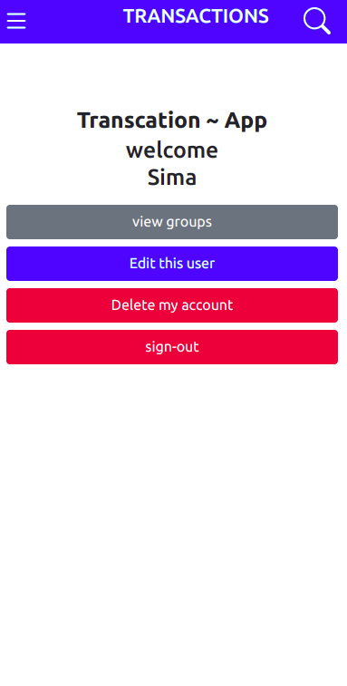

# BUDGET APP

A Ruby on Rails capstone project that is about a mobile web application where you can manage your budget: you have a list of transactions associated with a category, so that you can see how much money you spent and on what.

## Built with

- HTML
- Bootstrap
- Ruby on Rails
- Visual Studio Code
- Lots of love :heart:

## Screenshot

Design Image  |  Design Image
:-------------------------:|:-------------------------:
 |  |  |  |  | 

## Live Demo

[Live Link](https://tolu-transaction.herokuapp.com/users/sign_in)

## Run Tests

```
rspec spec/user_spec.rb 
```
```
rspec spec/operation_spec.rb 
```
```
rspec spec/group_spec.rb 
```

## Author:

**Toluwase Ajise**

[<code></code>](https://github.com/whoistolu)
[<code></code>](https://twitter.com/Littletolu)
[<code></code>](https://www.linkedin.com/in/toluwase-ajise-9b40411b2/)
<a href="digittolu25@gmail.com?subject=Hello Tolu!"></a>

##  Contributing

Contributions, issues and feature requests are welcome!

Feel free to check the [issues page](https://github.com/Whoistolu/budget-app/issues).

## Show your support

Give a 👍 if you like this project!

## Acknowledgments

- Original design idea by [Gregoire Vella on Behance](https://www.behance.net/gregoirevella).

## 📝 License

This project is [MIT](./LICENSE.md) licensed.
